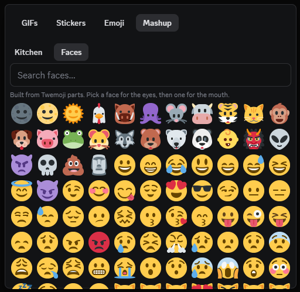

# EmojiMashup

[](https://github.com/Giftedx/vc-emoji-mashup/actions/workflows/ci.yml)
[](https://github.com/Giftedx/vc-emoji-mashup/releases/latest)
[](./LICENSE)

A [Vencord](https://vencord.dev) userplugin that adds a **Mashup** tab to Discord's
emoji picker. Two engines combine emoji:

- **[Emoji Kitchen](https://emojikitchen.dev)** has 147,000 combinations across 619
  emoji, drawn by hand at Google. It needs no API key, no server and no account.
- **Faces** builds images in your client from cut-up Twemoji, in the style of the
  original [Emoji Mashup Bot](https://knowyourmeme.com/memes/sites/emoji-mashup-bot).

Select an emoji, browse the mashups it has, then click one to send it.


**[How it works](#how-it-works)** · **[Installation](#installation)** ·
**[Settings](#settings)** · **[Development](#development)** ·
**[Limitations](#limitations)** · **[Credits](#credits)**

## How it works

Pick any emoji on the first page. The second page fills with every mashup that
emoji has, and each cell shows the finished image. You see only combinations that
exist, so no cell is a dead end.

Click a cell and the plugin puts the image URL into your message box. Discord
embeds it on the server, so the recipients see the image.

- **Search and a category filter** cover all 619 supported emoji.
- The **Recent** row keeps your last 24 Kitchen mashups.
- **Emoji sets** draw the picker in the Twitter, Google or system style.

### Kitchen or Faces

The **Kitchen / Faces** switch selects the engine.

**Kitchen** sends a URL for artwork Google drew. It covers objects, animals, food
and faces, and the images carry more detail.

**Faces** builds each image in your client from three Twemoji pieces: a base shape,
one emoji's eyes, another's mouth. The plugin uploads the result as an attachment.
There are 135 × 129 combinations, and the order matters, so a reversed pair gives a
different face. This engine covers faces only, because a coffee cup has no eyes to
lend. It reaches pairs Google never drew, which is what the original bot made
before Emoji Kitchen existed.



## Installation

Follow the official guide to
[install custom plugins](https://docs.vencord.dev/installing/custom-plugins/).
Custom plugins need a build of Vencord from source.

Clone this repository into `src/userplugins`:

```bash
git clone https://github.com/Giftedx/vc-emoji-mashup src/userplugins/emojiMashup
pnpm build && pnpm inject
```

Restart Discord, then enable **EmojiMashup** in the Vencord settings.

> **Clone it. Do not link it.** esbuild resolves Vencord's `@utils/*` and
> `@webpack/*` aliases from the nearest `tsconfig.json` above each source file. A
> symlink resolves outside Vencord's tree, and the build fails with
> `Could not resolve "@utils/discord"`. For the same reason the config here is
> `tsconfig.dev.json`. A `tsconfig.json` beside `index.tsx` would override
> Vencord's.

### Preview permissions

Vencord blocks `www.gstatic.com`, which hosts the mashup images. At first open the
picker offers to allow that host, and Vencord's permission dialog opens. Select the
trust checkbox, then restart Discord.

You can decline. Sending still works, because Discord gets the image on the server.
Without the permission, each combination shows its two source emoji instead of a
preview.

## Settings

| Setting | Default | Effect |
|---|---|---|
| Emoji set | Twitter | Artwork for the emoji you select from: Twitter, Google or system |
| Send mode | Insert URL | For Kitchen: put the URL into the message box, or copy it. Faces always opens Discord's upload prompt |
| Auto-close | On | Close the picker after you select a mashup |

## Development

Contributions are welcome. [CONTRIBUTING.md](./CONTRIBUTING.md) has the ground
rules, and [CHANGELOG.md](./CHANGELOG.md) the release history.

```bash
pnpm install
pnpm check       # typecheck + tests, the two gates CI runs first
```

[docs/DEVELOPMENT.md](./docs/DEVELOPMENT.md) covers the rest: the gates, the packed
index, the webpack patch behind the tab, and the design rationale.

## Limitations

- Kitchen covers **619 emoji** and only the pairs Google drew. No algorithm
  generates them.
- **Custom server emoji have no artwork**, so you cannot combine them.
- **You cannot restyle Kitchen mashups.** The emoji-set setting changes the emoji
  you select from, never the artwork. Faces is the Twemoji-styled alternative, but
  it generates faces rather than restyling them.
- **No Microsoft Fluent mashups.** Emojipedia hosts some, but nobody publishes the
  cut-up Fluent parts to build them, and cutting them by hand is an art task.
- A mashup sends as a URL, not as a true emoji. Discord cannot send an arbitrary
  image inline as an emoji.
- The Google emoji set covers 617 of 619. ©️ and ®️ have no Noto asset and use your
  system font.
- **Kitchen needs the network at first open**, because the plugin fetches the
  index. The plugin caches it for the session. Faces works without the index, but
  it fetches its layer images, so both engines need a connection.

## Credits

Kitchen artwork © Google, from [Emoji Kitchen](https://emojikitchen.dev). Pair
metadata from
[xsalazar/emoji-kitchen](https://github.com/xsalazar/emoji-kitchen). The plugin
links to the images on Google's CDN and never redistributes them. The packed index
holds only factual pair data: which combinations exist, and when they shipped.

Faces uses cut-up Twemoji parts from
[Ryhon0/open-emoji-mash](https://github.com/Ryhon0/open-emoji-mash) (GPL-3.0),
fetched from jsDelivr at a pinned commit. Twemoji artwork © Twitter, CC-BY 4.0. The
technique comes from Louan Bengmah's
[Emoji Mashup Bot](https://knowyourmeme.com/memes/sites/emoji-mashup-bot).

## Licence

[GPL-3.0-or-later](./LICENSE), the same as Vencord.
