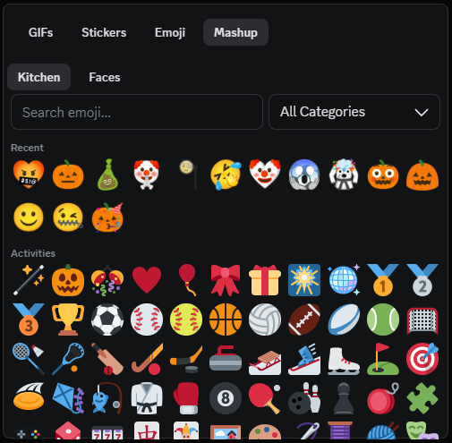

# EmojiMashup

A [Vencord](https://vencord.dev) userplugin that adds a **Mashup** tab to Discord's
emoji picker, with two ways to combine emoji:

- **[Emoji Kitchen](https://emojikitchen.dev)** — 147,000 combinations across 619
  emoji, hand-drawn by Google. Bundled, so no API key, server or account.
- **Faces** — mashups built at runtime from cut-up Twemoji, in the style of the
  original [Emoji Mashup Bot](https://knowyourmeme.com/memes/sites/emoji-mashup-bot).

Pick an emoji, browse the mashups it actually has, click one to send.



## How it works

Pick a left emoji from the grid, and the second page fills with **every mashup that
emoji really has** — each cell showing the finished image rather than the ingredients.
There are no dead ends: you only ever see combinations Google actually drew.

Clicking one inserts its image URL into your message box. Discord embeds it
server-side, so recipients see the image.

- **Search and category filter** over all 619 supported emoji
- **Recent** row remembering your last 24 Emoji Kitchen mashups
- **Emoji sets** — render the picker in Twitter, Google or your system emoji style
- Also available as a chat-bar button, which keeps working if the tab patch ever breaks

### Two mashup engines

The picker has a **Kitchen / Faces** switch, because there are two genuinely
different ways to mash emoji together.

**Kitchen** is Google's Emoji Kitchen: 147,000 combinations across 619 emoji,
*hand-drawn* by Google's designers. Objects, animals, food, faces. Sent as a URL
that Discord embeds.

**Faces** is the [Emoji Mashup Bot](https://knowyourmeme.com/memes/sites/emoji-mashup-bot)
lineage: mashups *composited at runtime* from cut-up Twemoji — a base shape, one
emoji's eyes, another's mouth. 135 × 128 combinations, and order matters, so
swapping the two gives a different face. Faces only, since a coffee cup has no
eyes to borrow. These are generated in your client, so they upload as an image
attachment rather than a link.

Google's are more polished; Twemoji's cover pairings Google never drew, and are
what the original bot did before Emoji Kitchen existed.

> There is no Microsoft Fluent equivalent here. Emojipedia hosts one, but nobody
> publishes the cut-up Fluent parts needed to build it, and cutting them by hand
> is an art task rather than a coding one.

## Installation

Follow the official guide for
[installing custom plugins](https://docs.vencord.dev/installing/custom-plugins/) —
custom plugins require building Vencord from source.

Once you have a source install, clone this into `src/userplugins`:

```bash
git clone https://github.com/Giftedx/vc-emoji-mashup src/userplugins/emojiMashup
pnpm build && pnpm inject
```

Then restart Discord and enable **EmojiMashup** in Vencord settings.

> **Clone it, don't symlink it.** esbuild resolves Vencord's `@api/*` and `@utils/*`
> aliases from the nearest `tsconfig.json` above each source file. A symlink or
> junction resolves outside Vencord's tree and breaks the build with
> `Could not resolve "@api/ChatButtons"`. The dev config here is named
> `tsconfig.dev.json` for the same reason — a `tsconfig.json` beside `index.tsx`
> would shadow Vencord's.

### Preview permissions

Mashup images are hosted on `www.gstatic.com`, which Vencord blocks by default. The
first time you open the picker it offers to allow that host, which opens Vencord's
own permission dialog; you'll need to tick the trust checkbox and restart Discord.

**Declining is fine.** Sending works either way, since Discord fetches the image
server-side. Without the permission, combinations show as their two source emoji
instead of a preview.

## Settings

| Setting | Default | Effect |
|---|---|---|
| Emoji set | Twitter | Artwork for the emoji you pick from — Twitter, Google, or system |
| Send mode | Insert URL | For Kitchen: insert the URL into the message box, or copy it to the clipboard. Faces always open Discord's image-upload prompt |
| Auto-close | On | Close either picker surface after choosing a mashup |

## Development

```bash
pnpm install
pnpm test        # unit tests plus integration tests against the real index
pnpm typecheck
pnpm verify-assets
pnpm verify-host-layout -- C:\path\to\Vencord
pnpm verify-patches -- C:\path\to\Vencord
```

If pnpm aborts with `ERR_PNPM_ABORTED_REMOVE_MODULES_DIR_NO_TTY` (it wants to
rebuild `node_modules` but has no TTY to ask), run `CI=true pnpm install`.

Linting and the Vencord-facing typecheck use Vencord's own configuration, so run
them from your Vencord checkout after cloning this repository into
`src/userplugins/emojiMashup`:

```bash
pnpm build
pnpm testTsc
pnpm exec eslint "src/userplugins/emojiMashup/**/*.{ts,tsx,mts}"
```

`codec.ts`, `kitchen.ts`, `emojiSets.ts` and `loadKitchen.ts` import nothing from
React or Vencord, which is what makes them testable in isolation. `index.tsx` and
`MashupPicker.tsx` are typechecked by Vencord's `testTsc` gate instead —
`tsconfig.dev.json` deliberately excludes them. CI repeats the build, typecheck
and lint against a fresh checkout of current Vencord so host API drift is visible
before release. `verify-host-layout` runs the same three gates against a complete
copy of this repository in a temporary worktree of the supplied Vencord checkout;
the checkout must already have its dependencies installed.

### Regenerating the index

`kitchenIndex.b64` holds the packed index and `kitchenIndexMeta.ts` its
provenance. Both are generated and committed. Rebuild them when Google ships new
mashups (historically a few times a year):

```bash
NODE_OPTIONS=--max-old-space-size=4096 pnpm build-index
```

It downloads the ~94 MB upstream metadata from a pinned commit, records the
input's SHA-256 in the generated file, strips it to a 375 KB gzipped index,
asserts invariants (619 emoji, at least 140k pairs, dates fitting the 7-bit
field), and HEAD-checks 20 sampled URLs against live gstatic. Any failure aborts
the build rather than shipping something broken. Set `METADATA_PATH` to reuse a
local copy; its content hash is still recomputed and recorded.

After committing a regenerated index, repin `INDEX_PIN` in `loadKitchen.ts` to
that commit. `build-index` prints the reminder, and `pnpm test` fails if the
index and its recorded digest ever drift apart.

The Twemoji parts inventory for Faces mode has its own generator, pinned to an
upstream commit so part URLs can't shift under a moving branch:

```bash
pnpm build-parts     # regenerate twemojiParts.ts
pnpm verify-parts    # confirm sampled layer URLs still resolve
pnpm verify-assets   # check Kitchen, face layers, Twemoji and pinned Noto assets
```

`verify-assets` applies a ten-second timeout to every request and also verifies
the CORS header required to flatten the SVG face layers into a canvas safely.

### Why the index is fetched, not bundled

The index is downloaded on first picker open from a commit-pinned jsDelivr URL,
and its SHA-256 is checked before it is decoded.

The alternative — compiling it in, which is what this plugin used to do — costs
every Vencord user the download whether or not they enable the plugin, because
plugins are compiled into one bundle and enabling is a runtime switch. Measured
against a real build, bundling added **520 KB raw / 292 KB gzipped**, more than
doubling Vencord's renderer over the wire. Fetching costs **20 KB raw / 6 KB
gzipped**, and only people who open the picker pay for the rest. For scale, the
largest file anywhere in Vencord's own `src/plugins` is 40 KB.

Fetching runtime data is the ordinary way to do this — `clearURLs`, `petpet`,
`oneko`, `reactErrorDecoder` and `shikiCodeblocks` all do it, and `jsdelivr.net`
is already in Vencord's default CSP allowlist, so no host permission is involved.

The cost is honest: no network, no Kitchen grid. Faces mode is unaffected, since
its parts inventory is 7 KB and already fetched, so the picker degrades to Faces
rather than to nothing.

### Why the index is packed

The upstream metadata is ~94 MB of JSON, almost all of it derivable. Every asset URL
follows `.../emojikitchen/{date}/{L}/{L}_{R}.png`, so the only facts worth storing
per pair are its date and one bit of orientation — the URL's left-hand emoji is the
lower-indexed one in just 62,501 of 147,000 pairs, so inferring it would break 57%
of lookups. That gets each pair down to 5 bytes, and the dataset to 375 KB gzipped.

One rule to know before touching URL building: **every codepoint component takes its
own `u` prefix**. `263a-fe0f` becomes `u263a-ufe0f`, not `u263a-fe0f`. The naive form
matches only 75.9% of pairs and 404s on the rest. Tests pin this.

### The picker tab patch

The tab is a webpack patch against Discord's minified expression picker, so it will
eventually break when Discord reships their bundle. When it does, Vencord logs
`Patch by EmojiMashup had no effect` and undoes the patch group — the picker is left
untouched and the chat-bar button keeps working.

To re-derive the target module, run this in the Discord console:

```js
Object.keys(Vencord.Webpack.search("activeView", "soundboard"))
```

That returned exactly one module, whose source the three replacements in `index.tsx`
are written against.

### Compatibility gate

The deterministic release gate is:

1. this repository's tests and typecheck;
2. build, typecheck and lint inside current Vencord;
3. live asset verification;
4. the patch applying to Discord's live bundle; and
5. a real Discord smoke of the picker tab and chat-bar fallback.

Step 4 is `pnpm verify-patches`, and it runs in CI on every push and weekly:

```bash
pnpm verify-patches -- C:\path\to\Vencord
```

It builds Vencord's reporter bundle with this plugin inside a throwaway
worktree, opens `discord.com/login` under headless Chromium, and asserts the
expression-picker module was patched by EmojiMashup with all three replacements
present in the patched source. **Nothing signs in and nothing is sent** — the
patch applies while Discord's webpack modules load, which happens on the login
page, so no account is involved.

Two details make it a real check rather than a reassuring one. It asserts the
patched source *positively*, because a plugin that never compiled in also never
reports a failure. And it builds with `--dev`, because Vencord only records a
factory's patched source when `IS_DEV` — without it the evidence does not exist
to read.

The patch was last verified against Discord build **582977**, module
**731231**. Treat that as evidence of the last verification, not a compatibility
promise: Discord can replace the minified module at any time, at which point
this job goes red and the chat-bar fallback keeps working.

Step 5 stays manual: whether a mashup actually arrives in a channel needs a
logged-in client, and no gate here does that for you. It was last performed on
2026-07-25 against build 582977, covering both engines on both surfaces —
Kitchen sending its URL and Faces uploading its flattened image, from the picker
tab and from the chat-bar button, plus re-sending from the Recent row. Kitchen
mode was re-checked after the index moved to a runtime fetch, since that changed
how it loads.

## Limitations

- Emoji Kitchen covers **619 emoji**, not the full Unicode set, and only the pairs
  Google actually drew. There is no algorithm generating these.
- **Custom server emoji can't be mashed up** — Google has no artwork for them.
- **Kitchen mashups can't be restyled.** The emoji-set setting changes the emoji you
  pick from, not the combinations — those are always Google's artwork. Faces mode is
  the Twemoji-styled alternative, but it generates rather than restyles, and covers
  only faces.
- **No Microsoft Fluent mashups.** No public library of cut-up Fluent parts exists.
- Mashups send as a URL, not as a real emoji. Discord has no mechanism for sending
  arbitrary images inline as emoji.
- The Google emoji set covers 617/619 — ©️ and ®️ have no Noto asset and fall back
  to your system font.
- **Kitchen mode needs network on first open**, since the index is fetched rather
  than bundled. It is cached for the session, and Faces mode stays usable without
  it.

## Credits

Kitchen mashup artwork © Google, from [Emoji Kitchen](https://emojikitchen.dev).
Pair metadata from [xsalazar/emoji-kitchen](https://github.com/xsalazar/emoji-kitchen).
Images are hot-linked from Google's CDN and never redistributed; the bundled index
holds only factual pair data — which combinations exist and when they shipped.

Faces mode uses cut-up Twemoji parts from
[Ryhon0/open-emoji-mash](https://github.com/Ryhon0/open-emoji-mash) (GPL-3.0),
fetched from jsDelivr at a pinned commit. Twemoji artwork © Twitter, CC-BY 4.0.
The technique comes from Louan Bengmah's
[Emoji Mashup Bot](https://knowyourmeme.com/memes/sites/emoji-mashup-bot).

## Licence

[GPL-3.0-or-later](./LICENSE), matching Vencord.
